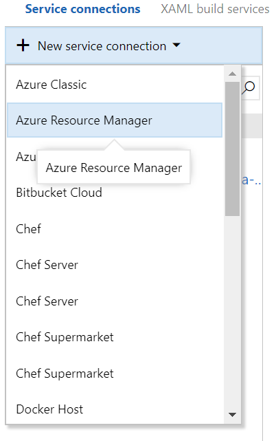

This Turtlesystems integration for Visual Studio Team Services provides a task which can create and upload files to and Azure Storage container. Additionally it will create a SAS token for allowing access to the files.

For example, when developing and testing an Azure Resource Manager (ARM) template, the task can be used to upload all the files to Blob storage. The deployment can then be performed pulling files from there.

# Requirements

As the task requires the ability to communicate with your Azure Subscription it uses the Azure Resource Manager connected service.

Be sure to create such a service for your build, so that it can be selected in the task settings.

# Parameters

There are a number of parameters for the task.

| Name | Description | Required | Default Value |
|---|---|---|---|
| Azure Subscription | The connected service for the Azure Subscription that will have the storage account | Yes | 
| Action | What action should be taken, `create` or `delete` | Yes | `create` |
| Resource Group | Resource group in which the storage account should be created | Yes | |
| Location | Location of the resource group in Azure | Yes | |
| Storage Account Name | Name of the storage account | Yes | | 
| Container Name | Name of the container within the storage account | Yes | "" |
| Upload Directory | The directory from which files should be uploaded | Yes | |
| SAS Token Start Time | When the SAS token should start. The value specified here is minus from now | Yes | 1m |
| SAS Token Expiry Time | When the SAS token should expire. | Yes | 1h |

## Actions

As can be seen from the parameters, there are two actions that can be specified:

 - `create`
 - `delete`

When using `create` the task will create the named Resource Group, the storage account and the container. If any of these resources already exist, they will be unmodified.

When using the `delete`, the task will remove the specified Resource Group. This is a _very_ destructive operation because any other resources in that resource group will also be deleted. Use with caution.